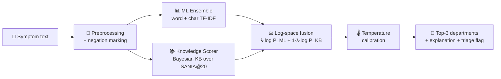

<div align="center">

# 🩺 DocPredic ML

### AI-Powered Medical Specialty Triage from Natural-Language Symptoms

*Type your symptoms in plain English → get the right doctor department with calibrated confidence.*

[](https://www.python.org/)
[](https://fastapi.tiangolo.com/)
[](https://scikit-learn.org/)
[](https://pytorch.org/)
[](https://www.docker.com/)

[](./docpredic_ml/artifacts/metrics/fused_system_metrics.json)
[](./docpredic_ml/artifacts/metrics/fused_system_metrics.json)
[](./docpredic_ml/artifacts/metrics/fused_system_metrics.json)
[](#-supported-specialties-19)
[](#-license)

[🚀 Quick Start](#-quick-start) • [📖 How It Works](#-how-it-works) • [📊 Results](#-results) • [🔌 API](#-rest-api) • [💬 Demo](#-try-it-interactive-cli)

> ⚠️ **Medical disclaimer:** DocPredic is a *triage-support* tool, not a diagnosis. Always consult a qualified doctor.

</div>

---

## ✨ What is DocPredic?

Patients often don't know **which specialist to see**. DocPredic solves that: it reads a free-text symptom description and predicts the most likely hospital department — with confidence scores, explanations, and a low-confidence safety flag.

```
"I have crushing chest pain radiating to my left arm and I'm sweating"
        │
        ▼
┌──────────────────────────────────────────────┐
│  🥇 CARDIOLOGY .............. 94.2% ██████████ │
│  🥈 PULMONOLOGY .............  3.1% ▌          │
│  🥉 GENERAL MEDICINE ........  1.2% ▏          │
│  Detected symptoms: chest pain, diaphoresis   │
└──────────────────────────────────────────────┘
```

### 🌟 Highlights

| Feature | Details |
|---|---|
| 🧠 **Fused AI system** | Soft-voting ML ensemble (LogReg + ComplementNB + calibrated LinearSVC) **×** Bayesian knowledge scorer over the doctor-curated symptom matrix |
| 🌡️ **Calibrated confidence** | Temperature scaling (T ≈ 0.60) → ECE of just **0.025** — probabilities you can trust |
| 🛡️ **Negation-aware** | *"no fever", "denies chest pain"* are correctly handled via negation marking |
| 🔍 **Explainable** | Returns matched / denied symptoms, ML-vs-knowledge agreement, top-2 margin |
| 🚦 **Triage safety net** | Low-confidence flag (`conf < 0.35` or `margin < 0.10`) → advises in-person review |
| 🏥 **Real clinical data** | Trained on enriched synthetic corpus **+ MIMIC-IV ED** emergency data |
| ⚡ **3 ways to use** | Interactive CLI, REST API (FastAPI + Swagger), Docker container |

---

## 🧬 How It Works

<div align="center">



</div>

**The fusion equation:**

$$P_{final}(d \mid text) = \mathrm{softmax}\left(\frac{\lambda \log P_{ML}(d) + (1-\lambda) \log P_{KB}(d)}{T}\right)$$

With **KB-abstention backoff**: when the knowledge base matches no symptoms, fusion backs off to pure ML (`λ_eff = 1`) so uninformative KB mass can't dilute the prediction.

<details>
<summary><b>🔬 Pipeline stages (click to expand)</b></summary>

1. **Data** — `SANIA@20.xlsx` knowledge matrix (300+ symptom↔department links) → enriched synthetic texts (500/class) + MIMIC-IV ED chief complaints.
2. **Preprocessing** (`src/preprocessing.py`) — lowercasing, medical synonym normalization, negation marking (`no fever` → `NEG_fever`).
3. **Features** (`src/models.py`) — stacked word TF-IDF (1–2 grams) + char TF-IDF (3–5 grams) ≈ 10k+ features.
4. **ML ensemble** — `LogisticRegression + ComplementNB + Calibrated LinearSVC` with tuned vote weights `[0.34, 0.33, 0.33]`.
5. **Knowledge scorer** (`src/knowledge_scorer.py`) — IDF-weighted Bernoulli Naive Bayes over the doctor matrix with template pseudo-counts.
6. **Fusion + calibration** (`src/calibration.py`, `train_accurate.py`) — λ grid-tuned on validation accuracy, temperature T fitted on validation NLL.
7. **Inference** (`src/inference.py`) — single `Predictor` class serving CLI + API with explanations.

</details>

---

## 📊 Results

Measured on a held-out 15% test split (`docpredic_ml/artifacts/metrics/fused_system_metrics.json`):

<div align="center">

| System | Accuracy | Macro F1 | Weighted F1 |
|:---|:---:|:---:|:---:|
| 🏆 **Fused (ML + Knowledge)** | **91.65%** | **92.29%** | **91.66%** |
| ML ensemble only | 93.7% (val) | — | — |
| Knowledge base only | 72.8% (val) | — | — |
| Legacy single model | 81.32% | 77.29% | — |

| Extra metric | Value |
|:---|:---:|
| 🎯 Top-2 accuracy | **96.95%** |
| 🌡️ Expected Calibration Error | **0.025** |
| 📉 NLL | 0.300 |
| 🧩 Challenge-set top-1 / top-2 (61 hard cases) | **98.4% / 100%** |

</div>

---

## 🏥 Supported Specialties (19)

<details open>
<summary><b>Click to view all 19 departments</b></summary>

| # | Department | # | Department |
|---|---|---|---|
| 1 | CARDIOLOGY | 11 | NEUROLOGY |
| 2 | DENTISTRY | 12 | ONCOLOGY |
| 3 | DERMATOLOGY | 13 | OPHTHALMOLOGY |
| 4 | ENDOCRINOLOGY | 14 | ORTHOPEDICS |
| 5 | ENT | 15 | PEDIATRICS |
| 6 | GASTROENTEROLOGY | 16 | PSYCHIATRY |
| 7 | GENERAL MEDICINE | 17 | PULMONOLOGY |
| 8 | GYNECOLOGY & OBSTETRICS | 18 | RHEUMATOLOGY |
| 9 | HEMATOLOGY | 19 | UROLOGY |
| 10 | NEPHROLOGY | | |

</details>

---

## 📁 Project Structure

```
DocPredic ML/
├── 📄 interactive.py                 # CLI launcher (root entry point)
├── 📄 SANIA@20.xlsx                  # Doctor-curated symptom↔department matrix
├── 📁 mimic-iv/                      # MIMIC-IV ED demo dataset (clinical training data)
├── 📁 docpredic_ml/
│   ├── 📄 train_accurate.py          # 🏆 Fused high-accuracy training pipeline
│   ├── 📄 train.py                   # Legacy single-model training pipeline
│   ├── 📄 requirements.txt
│   ├── 📄 Dockerfile
│   ├── 📁 src/
│   │   ├── ⚙️ config.py              # Paths, hyperparams, constants
│   │   ├── 📥 data_loader.py / mimic_loader.py
│   │   ├── 🧹 preprocessing.py / symptom_normalization.py
│   │   ├── 🧠 models/ / feature_engineering.py
│   │   ├── 📚 knowledge_scorer.py    # Bayesian KB scorer
│   │   ├── 🌡️ calibration.py        # Temperature scaling
│   │   ├── 🔮 inference.py           # Predictor (fused + legacy)
│   │   ├── 📊 evaluate.py / data_validation.py / training_text.py
│   │   └── 🧪 challenge_set.py       # 61 hard adversarial test cases
│   ├── 📁 api/main.py                # FastAPI service (/predict, /predict/batch, /health)
│   ├── 📁 artifacts/                 # Trained models, vectorizers, metrics (committed)
│   │   ├── models/ {fused_ensemble, knowledge_scorer, fusion_params, best_model…}
│   │   ├── label_encoders/ · tokenizers/ · metrics/
│   ├── 📁 data/{raw,interim,processed}
│   ├── 📁 notebooks/                 # (your experiments go here)
│   └── 📁 tests/                     # pytest suite
└── 📄 README.md
```

---

## 🚀 Quick Start

### 1️⃣ Prerequisites

- Python **3.11+**
- (Optional) Docker

### 2️⃣ Install

```bash
git clone https://github.com/bidyutpaul/docpredic_ml.git
cd docpredic_ml/docpredic_ml        # project package lives in docpredic_ml/
pip install -r requirements.txt
```

> 💡 NLTK data downloads automatically on first run (no manual setup).

### 3️⃣ Run — pick your interface

**💬 Option A — Interactive CLI (easiest)**

```bash
# from repo root:
python interactive.py
```

```
======================================================================
             DOCPREDIC MEDICAL SPECIALTY PREDICTOR
======================================================================
[OK] Fused high-accuracy system loaded (ensemble + Bayesian knowledge scorer).
Patient Symptoms > I have severe headache, dizziness and vomited twice
--------------------------------------------------
Top Recommendation : NEUROLOGY
Confidence         : 87.4%

Top 3 Department Options:
  1. NEUROLOGY                  87.4%  [=====================]
  2. OPHTHALMOLOGY               5.2%  [=]
  3. GENERAL MEDICINE             3.8%  []
--------------------------------------------------
```

**🔌 Option B — REST API**

```bash
cd docpredic_ml
uvicorn api.main:app --reload --port 8000
# Swagger UI → http://localhost:8000/docs
```

```bash
curl -X POST http://localhost:8000/predict \
  -H "Content-Type: application/json" \
  -d '{"text": "crushing chest pain radiating to left arm with sweating"}'
```

**🐳 Option C — Docker**

```bash
cd docpredic_ml
docker build -t docpredic .
docker run -p 8000:8000 docpredic
```

---

## 🏋️ Training

| Script | What it does | When to use |
|---|---|---|
| `python train_accurate.py` | Trains the **fused system** (ensemble + KB + λ/T tuning), saves `fused_ensemble.joblib`, `knowledge_scorer.joblib`, `fusion_params.json` | ✅ Default — best accuracy |
| `python train.py` | Trains legacy single-model benchmark (LogReg / NB / SVC / XGBoost), saves `best_model.joblib` | Baseline comparison |

```bash
cd docpredic_ml
python train_accurate.py   # ~7 stages: data → preprocess → TF-IDF → ensemble → KB fusion → calibrate → evaluate
```

Artifacts land in `artifacts/` (models, vectorizers, `metrics/fused_system_metrics.json`) and are auto-loaded by both the CLI and API — legacy files are never overwritten.

---

## 🔌 REST API

| Method | Endpoint | Description |
|---|---|---|
| `GET` | `/health` | Liveness + `model_loaded` flag |
| `POST` | `/predict` | Single symptom text → top-3 departments + explanation |
| `POST` | `/predict/batch` | Batch prediction over multiple inputs |

**Request:**

```json
{
  "text": "I have been having severe headaches for two days, I feel dizzy and I have vomited twice."
}
```

**Response (abridged):**

```json
{
  "top_prediction": "NEUROLOGY",
  "top_confidence": 0.874,
  "predictions": [
    { "department": "NEUROLOGY", "confidence": 0.874 },
    { "department": "OPHTHALMOLOGY", "confidence": 0.052 },
    { "department": "GENERAL MEDICINE", "confidence": 0.038 }
  ],
  "model_type": "fused",
  "low_confidence": false,
  "explanation": {
    "matched_symptoms": ["headache", "dizziness", "vomiting"],
    "denied_symptoms": [],
    "ml_top": "NEUROLOGY",
    "knowledge_top": "NEUROLOGY",
    "models_agree": true,
    "margin_top2": 0.82
  }
}
```

Full interactive docs with **Try it out** buttons: `http://localhost:8000/docs` (Swagger) and `/redoc`.

---

## 💬 Try It — Example Queries

| Symptom text | Expected top prediction |
|---|---|
| *"crushing chest pain radiating to left arm with sweating"* | CARDIOLOGY |
| *"itchy red skin rash with swelling on arms"* | DERMATOLOGY |
| *"toothache with swollen bleeding gums"* | DENTISTRY |
| *"burning urination with lower abdominal pain"* | UROLOGY |
| *"no fever but persistent dry cough and breathlessness"* | PULMONOLOGY *(negation handled ✓)* |

---

## 🧪 Testing

```bash
cd docpredic_ml
pytest tests/ -v
```

| Test file | Covers |
|---|---|
| `test_api.py` | FastAPI routes & Pydantic schemas |
| `test_data_loader.py` | Knowledge-matrix + combined dataset loading |
| `test_models.py` | Ensemble construction & feature stacking |
| `test_preprocessing.py` | Text cleaning, negation marking |

Plus a built-in **61-case adversarial challenge set** (`src/challenge_set.py`) evaluated automatically at the end of `train_accurate.py`.

---

## 🛠️ Tech Stack

<div align="center">

| Layer | Tools |
|:---|:---|
| ML / NLP | scikit-learn · XGBoost · PyTorch · Transformers · NLTK · imbalanced-learn |
| Features | TF-IDF (word + char) · negation marking · synonym normalization |
| Serving | FastAPI · Pydantic · Uvicorn · Docker |
| Data | pandas · NumPy · SciPy · MIMIC-IV ED · openpyxl |
| Quality | pytest · temperature-scaling calibration · ECE/NLL tracking |

</div>

---

## 🗺️ Roadmap

- [ ] 🌐 Web UI (React + Tailwind triage chatbot)
- [ ] 🗣️ Multilingual symptom input (Hindi / Bengali)
- [ ] 📱 Progressive Web App for clinics
- [ ] 🔄 MLflow experiment tracking + model registry
- [ ] 🧠 Transformer (BioClinicalBERT) backbone option
- [ ] ☁️ One-click deploy (Hugging Face Spaces / Render)

---

## 🤝 Contributing

Contributions are welcome!

```bash
1. Fork the repo
2. git checkout -b feature/my-improvement
3. pytest tests/ -v          # make sure everything passes
4. git commit -m "feat: ..."
5. Open a Pull Request
```

Please keep the medical disclaimer intact and add tests for new features.

---

## 📄 License

MIT — see [LICENSE](LICENSE) (or add one). Free for research and educational use.

---

## 🙏 Acknowledgments

- Doctors behind the **SANIA@20** symptom–department knowledge matrix
- **MIMIC-IV ED** (Beth Israel Deaconess / MIT) for real-world emergency data
- The open-source ML community ❤️

<div align="center">

**Built with 🩺 by [bidyutpaul](https://github.com/bidyutpaul)**

*Helping patients find the right doctor, faster.*

⭐ Star this repo if you find it useful!

</div>
